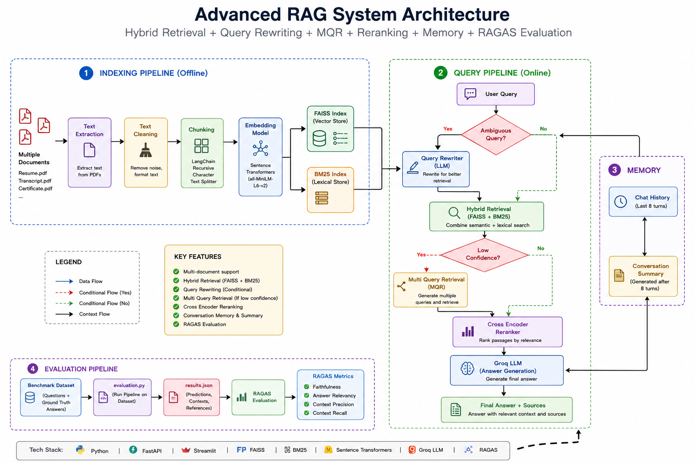
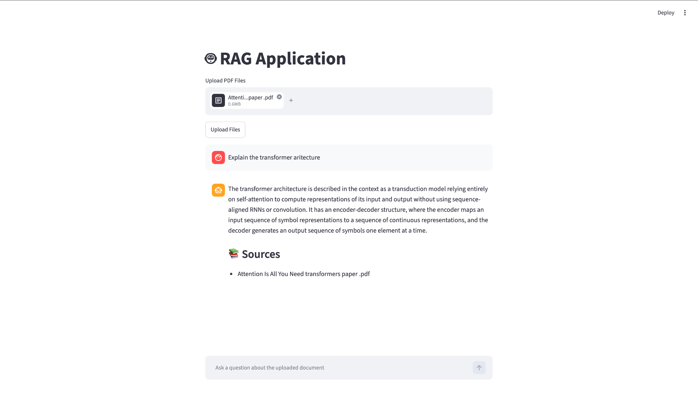

## 🛠️ Tech Stack

<p align="center">


</p>

# 🚀 Adaptive RAG Pipeline

A production-inspired Retrieval-Augmented Generation (RAG) system for intelligent PDF question answering using Hybrid Retrieval, Query Rewriting, Multi-Query Retrieval (MQR), Cross-Encoder Reranking, Conversation Memory, Source Citations, and RAGAS Evaluation.

---

## 📌 Overview

Adaptive RAG Pipeline improves retrieval quality by dynamically adapting to user queries and retrieval confidence.

The system combines semantic search, lexical search, query understanding, reranking, and conversational memory to generate accurate and grounded responses from uploaded PDF documents.

---

## ✨ Features

### 🔍 Retrieval Layer

* FAISS Vector Search
* BM25 Lexical Search
* Hybrid Retrieval (FAISS + BM25)

### 🧠 Query Understanding

* Query Rewriting
* Multi-Query Retrieval (MQR)
* Dynamic Retrieval Strategy

### 📈 Ranking

* Cross-Encoder Reranking

### 💬 Conversational Memory

* Chat History Tracking
* Automatic Conversation Summarization

### 📚 Grounded Responses

* Source Citations
* Context-Aware Answer Generation

### 📊 Evaluation

* RAGAS Evaluation Pipeline

### ⚙️ Deployment

* Dockerized Architecture
* FastAPI Backend
* Streamlit Frontend

---

## 🏗️ System Architecture



---

## 🔄 Pipeline Flow

1. User uploads one or more PDF documents.
2. Text is extracted and cleaned.
3. Documents are chunked into smaller passages.
4. Embeddings are generated.
5. FAISS and BM25 indexes are built.
6. User submits a query.
7. Query Rewriter resolves ambiguous follow-up questions.
8. Hybrid Retrieval fetches relevant chunks.
9. Multi-Query Retrieval is triggered when retrieval confidence is low.
10. Cross-Encoder reranks retrieved chunks.
11. LLM generates a grounded response.
12. Source documents are returned as citations.
13. Conversation memory is updated and summarized.

---

## 📂 Project Structure

```text
adaptive-rag-pipeline/
│
├── backend/
│   ├── routers_rag/
│   ├── services_rag/
│   ├── evaluation/
│   ├── main.py
│   ├── requirements.txt
│   └── Dockerfile
│
├── frontend/
│   ├── app.py
│   ├── requirements.txt
│   └── Dockerfile
│
├── docker-compose.yml
├── .gitignore
├── .dockerignore
│
├── rag_architecture.png
├── ui_demo.png
│
└── README.md
```

---

## 🖥️ Demo

### Application Interface



---

## 📊 RAGAS Evaluation Results

| Metric            | Score  |
| ----------------- | ------ |
| Faithfulness      | 1.0000 |
| Answer Relevancy  | 0.9874 |
| Context Precision | 0.8929 |
| Context Recall    | 1.0000 |

### Interpretation

* **Faithfulness (1.00)** → Generated answers are fully grounded in retrieved context.
* **Answer Relevancy (0.9874)** → Answers closely match user questions.
* **Context Precision (0.8929)** → Most retrieved chunks are relevant.
* **Context Recall (1.00)** → Important information is successfully retrieved.

---

## 🛠️ Tech Stack

### Backend

* Python
* FastAPI
* LangChain
* Groq LLM

### Retrieval

* FAISS
* BM25
* Sentence Transformers

### Ranking

* Cross Encoder Reranker

### Frontend

* Streamlit

### Evaluation

* RAGAS

### Deployment

* Docker
* Docker Compose

---

## ⚙️ Running Locally

### Clone Repository

```bash
git clone https://github.com/varshithreddy39/adaptive-rag-pipeline.git

cd adaptive-rag-pipeline
```

### Configure Environment Variables

Create a `.env` file inside the backend directory:

```env
GROQ_API=your_groq_api_key
```

### Start Application

```bash
docker compose up --build
```

### Access Application

Frontend:

```text
http://localhost:8501
```

Backend:

```text
http://localhost:8000
```

---

## 🎯 Key Components

### Hybrid Retrieval

Combines semantic retrieval (FAISS) with keyword-based retrieval (BM25) to improve retrieval robustness.

### Query Rewriting

Resolves ambiguous conversational queries such as:

```text
What is my CGPA?
What about SGPA?
```

into standalone searchable questions.

### Multi-Query Retrieval (MQR)

Generates alternative search queries when retrieval confidence is low to improve recall.

### Cross-Encoder Reranking

Ranks retrieved chunks according to semantic relevance before answer generation.

### Conversation Memory

Maintains chat history and periodically summarizes conversations for long-term context retention.

### Source Citations

Returns document sources alongside generated answers to improve transparency and trustworthiness.

---

## 🔮 Future Improvements

* Adaptive Query Routing
* Prompt Injection Detection
* Observability & Tracing (LangSmith / Langfuse)
* Token Cost Monitoring
* Feedback Collection Pipeline
* Vector Database Integration (Pinecone / Weaviate)
* Multi-modal Document Understanding
* Agentic RAG Workflows

---
## 👨‍💻 Author

<p align="center">

<b>Venkata Varshith Reddy Mettukuru</b>

<br><br>

<a href="https://github.com/varshithreddy39">GitHub</a> •
<a href="https://www.linkedin.com/in/venkatavarshith/">LinkedIn</a>

</p>

<p align="center">
⭐ If you found this project useful, consider giving it a star and let's connect!
</p>

